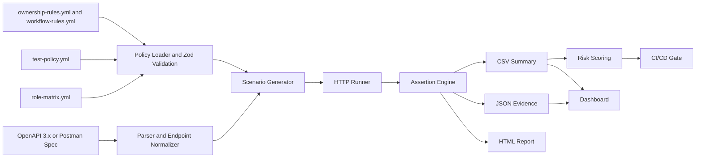

# SecureAPI-Gate

SecureAPI-Gate is a defensive CI/CD security regression gate for REST APIs. It parses an OpenAPI 3.x document or Postman collection, loads role and policy files, generates authorization-oriented security test cases, runs them against a target API, writes evidence, calculates a risk score, renders reports, and blocks CI/CD when the score is below a configured threshold.

Full title: **SecureAPI-Gate: A CI/CD Security Regression Gate for Detecting Authorization, Session, Object-Level, and Workflow Drift in REST APIs**.

The project is built as a reusable tool, not only as a vulnerable API demo. The included demo API is a local research target used to exercise the scanner in controlled vulnerable and fixed modes.

## Safety And Ethics

Use this project only for local, legal, defensive testing or for systems where you have explicit written permission. The repository does not include real credentials, exploit kits, malware, persistence, evasion, credential theft, or destructive payloads. Demo tokens are fake and the demo API is intended for local research reproducibility.

SecureAPI-Gate does not claim complete vulnerability detection. It implements a focused regression-testing artifact for policy-driven REST API security checks.

## Features

- OpenAPI 3.x YAML/JSON parsing through the core parser.
- Postman collection JSON parsing for request inventory extraction.
- Endpoint normalization for methods, route keys, path templates, and parameters.
- Zod-validated YAML configuration for role matrices, test policy, ownership rules, and workflow rules.
- Generation of 45 default security scenarios across nine categories.
- HTTP runner with timeout, retry, safe error handling, token lookup, and redaction.
- JSON evidence per scenario, CSV summary for research tables, and HTML report generation.
- SecureAPI risk score with category breakdown and CI/CD PASS or BLOCK decision.
- Commander.js CLI for init, validation, scan, report, score, and CI gate commands.
- Local Express demo API with vulnerable and fixed modes.
- React + Vite dashboard for evidence review.
- GitHub Actions and Docker Compose for repeatable CI-style execution.

## Architecture



## Workspaces

- `packages/core`: parsers, policy validation, test generation, runner, evidence, standards mapping, and scoring.
- `packages/cli`: `secureapi` command line interface.
- `packages/reporter`: HTML and Markdown report rendering utilities.
- `packages/dashboard`: React/Vite evidence dashboard.
- `examples/demo-api`: local Express API with vulnerable and fixed modes.

## Security Scenario Categories

The default generator creates five scenarios per category:

| Category      | Purpose                                                                                                |
| ------------- | ------------------------------------------------------------------------------------------------------ |
| BOLA          | Object-level ownership checks for profiles, orders, payments, tickets, and approval objects.           |
| BOPLA         | Mass assignment checks for role, `isAdmin`, account status, payment status, and approval state fields. |
| BFLA          | Function-level role abuse checks against admin, manager, user listing, and payment export endpoints.   |
| AUTH          | Missing, expired, invalid, wrong-audience, and weak-claim demo token handling.                         |
| SESSION       | Revoked token, stale role, tenant mismatch, subject mismatch, and post-logout replay checks.           |
| WORKFLOW      | Approval state transition abuse, payment-before-approval, completed workflow mutation, and replay.     |
| INVENTORY     | Internal version, deprecated, debug, unlisted admin, and API description exposure checks.              |
| THIRD_PARTY   | Simulated webhook signature, replay, malformed payload, tenant mismatch, and timeout behavior.         |
| ERROR_LEAKAGE | Stack trace, internal ID, ORM error, authorization detail, and existence-oracle checks.                |

## Installation

```bash
npm ci
npm run build
npm run test
npm run lint
npm run format:check
```

## CLI Commands

Create starter configuration:

```bash
npm run secureapi:init
```

Validate a config file:

```bash
npm run dev -w @secureapi-gate/cli -- validate-config --config ../../examples/configs/role-matrix.yml
```

Run a scan against an API:

```bash
npm run dev -w @secureapi-gate/cli -- scan \
  --spec ../../examples/specs/openapi.demo.yaml \
  --config ../../examples/configs/role-matrix.yml \
  --policy ../../examples/configs/test-policy.yml \
  --base-url http://localhost:3000 \
  --out ../../evidence
```

Generate a report from JSON evidence:

```bash
npm run secureapi:report
```

Calculate score from CSV:

```bash
npm run secureapi:score
```

Run the CI gate:

```bash
npm run secureapi:ci
```

## Demo API Runs

Run vulnerable mode in one terminal:

```bash
npm run demo:api:vulnerable
```

Scan vulnerable mode in another terminal:

```bash
npm run secureapi:scan:vulnerable
npm run secureapi:score
npm run secureapi:ci
```

Run fixed mode:

```bash
npm run demo:api:fixed
```

Scan fixed mode:

```bash
npm run secureapi:scan:fixed
npm run secureapi:score
npm run secureapi:ci
```

With the included demo fixtures, vulnerable mode is expected to block and fixed mode is expected to pass the default threshold. Treat generated evidence as a reproducible artifact for tool evaluation, not as a claim about third-party systems.

## Evidence And Reports

Scan output is written under `evidence/`:

- `evidence/json/*.json`: one evidence record per scenario.
- `evidence/csv/results-summary.csv`: compact summary for scoring and research tables.
- `evidence/html/report.html`: static report generated from evidence.

Each JSON record includes scenario ID, category, title, endpoint, actor role, redacted request, redacted response, expected behavior, observed status, pass/fail result, severity, risk weight, standards mapping, recommendation, timestamp, and tool version.

## Dashboard

Run the dashboard after evidence exists:

```bash
npm run dashboard
```

The dashboard reads `evidence/csv/results-summary.csv` and `evidence/json/*.json`, then displays overall score, pass/fail count, category failures, endpoint risk, standards coverage, evidence detail, and CI gate status.

## Docker Compose

Copy `.env.example` if you want local overrides:

```bash
cp .env.example .env
```

Start the demo API and dashboard:

```bash
docker compose up --build demo-api dashboard
```

Run a one-shot scan container:

```bash
docker compose --profile scan run --rm secureapi-scan
```

Set `SECUREAPI_DEMO_MODE=vulnerable` in `.env` to demonstrate a blocked gate intentionally.

## CI/CD Usage

Two workflows are included:

- `.github/workflows/ci.yml`: installs dependencies, builds, tests, lints, starts the fixed demo API, runs a scan, uploads evidence, and enforces threshold `85`.
- `.github/workflows/secureapi-gate.yml`: runs the same security gate on pull requests and supports manual fixed or vulnerable mode execution.

The CI gate exits `1` when the score is below threshold and `0` when the score is equal to or above threshold.

## Research Usage

The repository is intended to support an academic-style artifact package:

- scenario taxonomy in `docs/scenario-taxonomy.md`
- methodology in `docs/methodology.md`
- scoring model in `docs/scoring-model.md`
- standards mapping in `docs/standards-mapping.md`
- reproducibility guide in `docs/reproducibility-guide.md`
- research paper outline in `docs/research-paper-outline.md`

No real-world company data, production API results, or external benchmark dataset is included.

## Limitations

SecureAPI-Gate is a regression gate, not a complete API security scanner. Its effectiveness depends on the quality of the API specification, role matrix, policy files, tokens, and object/workflow fixture data. Current scenario execution is deterministic and useful for research, but deeper multi-step state setup, response semantic assertions, schema-aware payload mutation, and broad real API coverage are future work.

## Citation Placeholder

If you use this artifact in academic writing, cite the repository and include the exact commit, configuration files, generated evidence, Node.js version, and run commands used for reproduction.
